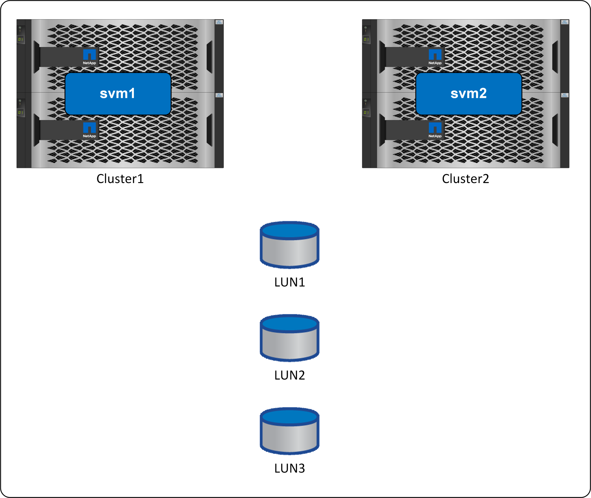

= 복제
:allow-uri-read: 

SnapMirror 액티브 동기화(이전 명칭: SnapMirror 비즈니스 연속성 또는 SM-BC)를 사용하면 운영 중단이 발생해도 개별 SQL Server 데이터베이스 및 애플리케이션의 서비스를 계속 제공할 수 있으며, 수동 작업 없이 투명한 스토리지 페일오버를 수행할 수 있습니다.

== 복제

SnapMirror 액티브 동기화(SM-AS)는 SnapMirror 동기식 을 기반으로 합니다. 둘 다 RPO=0 동기식 데이터 복제를 제공할 수 있지만 SM-AS는 SAN 데이터에 대해 제로에 가까운 RTO 가용성을 제공하여 솔루션을 더욱 강화해 줍니다. 이 작업은 데이터 가용성을 유지하기 위해 SAN 경로를 관리하는 자동화를 통해 수행됩니다. 사이트, 컨트롤러 및 통신 장애는 모두 ONTAP에 의해 자동으로 처리됩니다.

== 있습니다

SnapMirror 액티브 동기화는 서로 다른 두 사이트에 있는 LUN을 제공합니다. 정상 작동에는 "소스" 또는 "대상"이 없습니다. 방향은 양방향입니다. 지정된 LUN 경로에 대한 모든 읽기 입출력은 로컬 컨트롤러에서 데이터의 로컬 복제본을 사용하여 처리됩니다. 모든 쓰기가 원격 파트너에게 복제되고 확인 전에 로컬에 기록됩니다.

image:../media/smas-overview.png["SnapMirror Active Sync 개요"]

논리적으로 이 동작은 단일 LUN 세트와 같습니다. 서로 다른 두 클러스터에 있는 SAN 경로를 통해 이러한 논리 LUN에서 입출력을 지정할 수 있지만 데이터는 항상 동일합니다. IO 동작은 대부분의 액티브-액티브 애플리케이션 구성에 있어 중요한 대칭입니다.

== 경로 관리

SnapMirror 동기식 네트워크 토폴로지에는 균일하고 비균일한 두 가지 접근 방식이 있습니다. 단일 액세스와 비균일 액세스 중에서 선택할 때 고려해야 할 주요 사항은 SAN을 사이트 간에 확장할 수 있는지 여부입니다. SnapMirror 활성 동기화는 두 가지 상황에서 사용할 수 있습니다.

== 스토리지 하드웨어

다른 스토리지 재해 복구 솔루션과 달리 SnapMirror Active Sync는 비대칭적 플랫폼 유연성을 제공합니다. 각 사이트의 하드웨어는 동일할 필요가 없습니다. 이 기능을 사용하면 SnapMirror 액티브 동기화를 지원하는 데 사용되는 하드웨어를 적절한 크기로 조정할 수 있습니다. 전체 운영 워크로드를 지원해야 하는 경우 원격 스토리지 시스템이 기본 사이트와 동일할 수 있지만 재해로 인해 I/O가 감소할 경우 원격 사이트의 소규모 시스템보다 비용 효율적입니다.

== ONTAP 중재자

ONTAP 중재자는 NetApp 지원 사이트에서 다운로드되는 소프트웨어 애플리케이션으로, 일반적으로 가상 컴퓨터에 구축됩니다.

계획 및 구성 단계는 를 link:https://docs.netapp.com/us-en/ontap/snapmirror-active-sync/["SnapMirror 활성 동기화에 대한 ONTAP 문서"] 참조하십시오.
