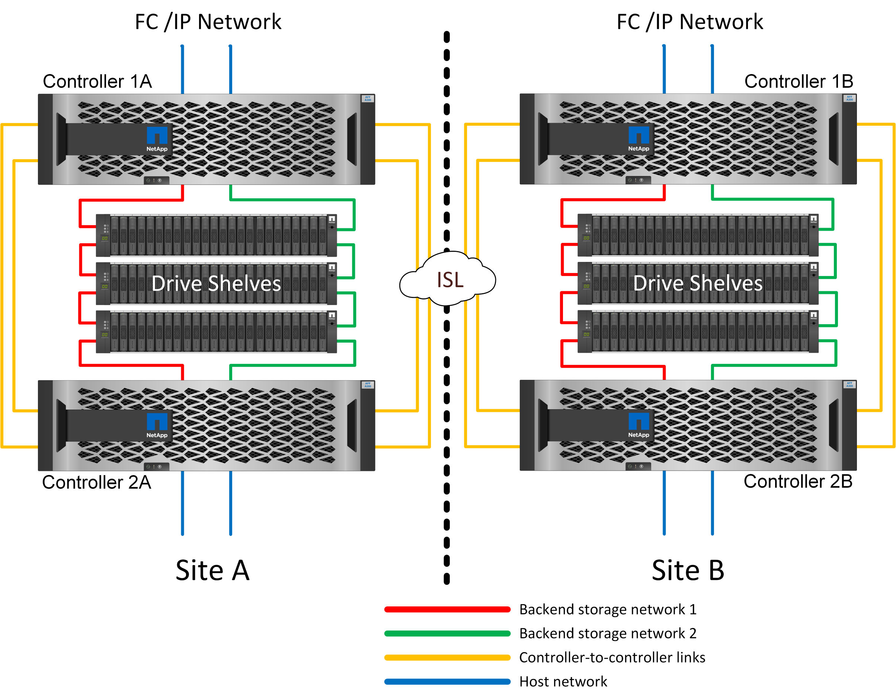
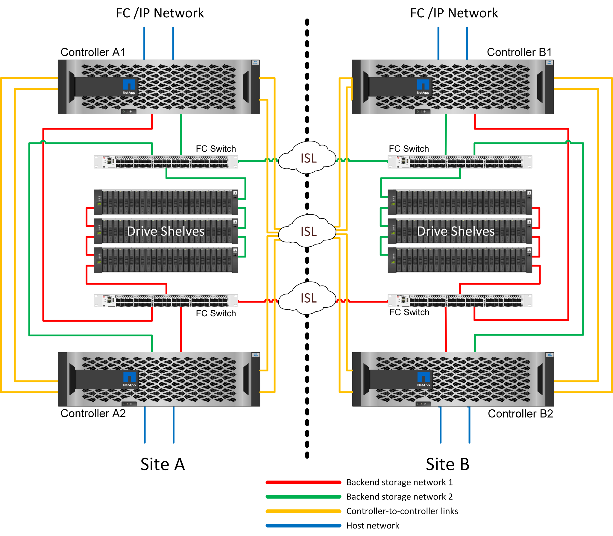
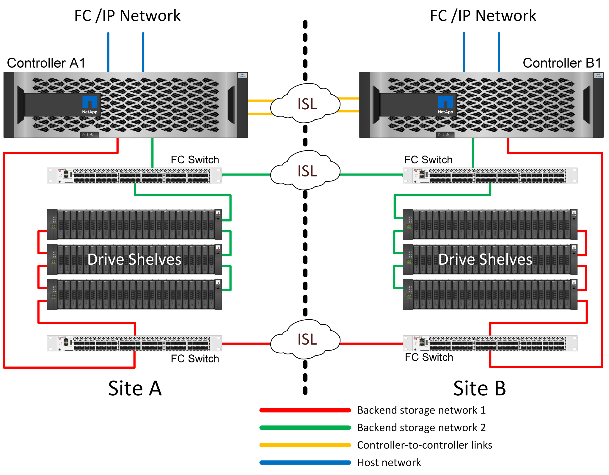

= 있습니다
:hardbreaks:
:allow-uri-read: 
:icons: font
:linkattrs: 
:imagesdir: ../media/

[role="lead"]
MetroCluster 환경에서 Microsoft SQL Server를 구축하려면 MetroCluster 시스템의 물리적 설계에 대해 몇 가지 설명이 필요합니다.

MetroCluster는 별도의 위치 또는 장애 도메인에 있는 두 ONTAP 클러스터 간에 데이터와 구성을 동기식으로 미러링합니다. MetroCluster은 두 가지 목표를 자동으로 관리하여 애플리케이션에 대해 지속적으로 사용 가능한 스토리지를 제공합니다.

* 클러스터에 기록된 데이터를 동기식으로 미러링하여 복구 시점 목표(RPO)를 0으로 설정합니다.
* 구성을 미러링하고 두 번째 사이트에서 데이터 액세스를 자동화하여 RTO(복구 시간 목표)가 거의 없는 환경입니다.

MetroCluster는 두 사이트에 있는 두 개의 독립적인 클러스터 간에 데이터와 구성을 자동으로 미러링하여 단순성 기능을 제공합니다. 스토리지가 한 클러스터 내에서 프로비저닝되면 두 번째 사이트의 두 번째 클러스터에 자동으로 미러링됩니다. NetApp SyncMirror ® 는 제로 RPO로 모든 데이터의 전체 복사본을 제공합니다. 즉, 한 사이트의 워크로드가 언제든지 반대쪽 사이트로 전환하고 데이터 손실 없이 데이터를 계속 제공할 수 있습니다. MetroCluster는 2차 사이트에서 NAS와 SAN 프로비저닝된 데이터에 대한 액세스를 제공하는 스위치오버 프로세스를 관리합니다. 검증된 솔루션으로 설계된 MetroCluster에는 프로토콜 시간 초과 기간 내에 또는 대개 120초 미만 으로 전환할 수 있는 크기 조정과 구성이 포함되어 있습니다. 따라서 RPO가 거의 0에 가까우며 애플리케이션이 장애 발생 없이 데이터에 계속 액세스할 수 있습니다. MetroCluster는 백엔드 스토리지 패브릭에 정의된 다양한 버전으로 사용할 수 있습니다.

== MetroCluster는 3가지 구성으로 사용할 수 있습니다

* IP 연결이 포함된 HA 쌍
* FC 연결이 포함된 HA 쌍
* FC 연결이 포함된 단일 컨트롤러

NOTE: '접속'이라는 용어는 사이트 간 복제에 사용되는 클러스터 접속을 의미합니다. 호스트 프로토콜을 참조하지 않습니다. 모든 호스트측 프로토콜은 클러스터 간 통신에 사용되는 연결 유형에 관계없이 MetroCluster 구성에서 평소와 같이 지원됩니다.

== MetroCluster IP를 선택합니다

HA 쌍 MetroCluster IP 구성은 사이트당 2~4개의 노드를 사용합니다. 이 구성 옵션은 2노드 옵션에 비해 복잡성과 비용을 증가시키지만, 내부 중복이라는 중요한 이점을 제공합니다. 컨트롤러 장애가 간단하더라도 WAN을 통한 데이터 액세스가 필요하지 않습니다. 데이터 액세스는 대체 로컬 컨트롤러를 통해 로컬에 유지됩니다.

대부분의 고객은 인프라 요구 사항이 더 간단하기 때문에 IP 연결을 선택하고 있습니다. 과거에는 다크 파이버 및 FC 스위치를 사용하여 고속 사이트 간 연결을 제공하기가 일반적으로 더 쉬웠지만, 오늘날의 고속, 짧은 지연 시간 IP 회로는 보다 쉽게 사용할 수 있었습니다.

또한 사이트 간 연결만 컨트롤러를 위한 것이므로 아키텍처가 더욱 단순합니다. FC SAN 연결 MetroCluster에서 컨트롤러는 반대쪽 사이트의 드라이브에 직접 기록하므로 SAN 연결, 스위치 및 브리지가 추가로 필요합니다. 반면, IP 구성의 컨트롤러는 컨트롤러를 통해 반대쪽 드라이브에 씁니다.

자세한 내용은 공식 ONTAP 설명서 및 를 참조하십시오 https://www.netapp.com/pdf.html?item=/media/13481-tr4689.pdf["MetroCluster IP 솔루션 아키텍처 및 설계"^].

== HA-쌍 FC SAN 연결 MetroCluster

HA 쌍 MetroCluster FC 구성은 사이트당 2개 또는 4개의 노드를 사용합니다. 이 구성 옵션은 2노드 옵션에 비해 복잡성과 비용을 증가시키지만, 내부 중복이라는 중요한 이점을 제공합니다. 컨트롤러 장애가 간단하더라도 WAN을 통한 데이터 액세스가 필요하지 않습니다. 데이터 액세스는 대체 로컬 컨트롤러를 통해 로컬에 유지됩니다.

일부 멀티사이트 인프라는 액티브-액티브 운영을 위해 설계되지 않았지만 운영 사이트 및 재해 복구 사이트로 더 많이 사용됩니다. 이 상황에서 HA 쌍 MetroCluster 옵션이 일반적으로 다음과 같은 이유로 더 권장됩니다.

* 2노드 MetroCluster 클러스터는 HA 시스템이지만, 컨트롤러의 예상치 못한 장애나 계획된 유지 관리를 위해서는 반대쪽 사이트에서 데이터 서비스를 온라인으로 전환해야 합니다. 사이트 간 네트워크 연결이 필요한 대역폭을 지원할 수 없는 경우 성능이 영향을 받습니다. 유일한 옵션은 다양한 호스트 OS 및 관련 서비스를 대체 사이트로 페일오버하는 것입니다. HA Pair MetroCluster 클러스터는 동일한 사이트 내에서 단순한 페일오버가 발생하기 때문에 이 문제가 해소됩니다.
* 일부 네트워크 토폴로지는 사이트 간 액세스용으로 설계되지 않은 대신 서로 다른 서브넷이나 격리된 FC SAN을 사용합니다. 이런 경우 2노드 MetroCluster 클러스터는 다른 사이트의 서버에 데이터를 제공할 수 없기 때문에 더 이상 HA 시스템으로 작동하지 않습니다. 완벽한 이중화를 제공하려면 HA Pair MetroCluster 옵션이 필요합니다.
* 2개 사이트 인프라를 고가용성 단일 인프라로 간주하는 경우 2노드 MetroCluster 구성이 적합합니다. 하지만 사이트 장애 후 시스템이 오랫동안 작동해야 하는 경우에는 단일 사이트 내에서 HA를 계속 제공하기 때문에 HA 2노드가 선호됩니다.

== 2노드 FC SAN 연결 MetroCluster

2노드 MetroCluster 구성은 사이트당 하나의 노드만 사용합니다. 이 설계는 구성과 유지 관리가 필요한 구성 요소가 적기 때문에 HA 쌍 옵션보다 단순합니다. 또한 케이블 연결 및 FC 스위칭에 대한 인프라 요구도 줄었습니다. 마지막으로 비용을 절감할 수 있습니다.

이 설계의 분명한 영향은 단일 사이트에서 컨트롤러 장애가 발생하면 반대쪽 사이트에서 데이터를 사용할 수 있다는 것입니다. 이러한 제한이 반드시 문제가 되는 것은 아닙니다. 많은 기업은 기본적으로 단일 인프라로 작동하는 지연 시간이 짧은 확장된 고속 네트워크를 통해 멀티사이트 데이터 센터를 운영하고 있습니다. 이 경우 MetroCluster의 2노드 버전을 사용하는 것이 좋습니다. 현재 여러 서비스 공급자가 두 노드 시스템을 페타바이트 규모로 사용하고 있습니다.

== MetroCluster 복원력 기능

MetroCluster 솔루션에는 단일 장애 지점이 없습니다.

* 각 컨트롤러에는 로컬 사이트의 드라이브 쉘프에 대한 2개의 독립적 경로가 있습니다.
* 각 컨트롤러에는 원격 사이트의 드라이브 쉘프에 대한 두 개의 독립적 경로가 있습니다.
* 각 컨트롤러에는 반대쪽 사이트에 있는 컨트롤러에 대한 독립적인 경로가 2개 있습니다.
* HA 쌍 구성에서 각 컨트롤러에는 로컬 파트너에 대한 두 가지 경로가 있습니다.

요약하면, MetroCluster의 데이터 제공 기능에 영향을 주지 않으면서 구성의 모든 구성 요소를 제거할 수 있습니다. 두 옵션 간의 복원력에서 유일한 차이점은 HA 쌍 버전이 사이트 장애 발생 후 전체 HA 스토리지 시스템이라는 점입니다.

== SyncMirror

MetroCluster를 사용하는 SQL Server에 대한 보호는 최대 성능, 스케일아웃 동기식 미러링 기술을 제공하는 SyncMirror를 기반으로 합니다.

== SyncMirror를 사용한 데이터 보호

가장 간단한 수준인 동기식 복제는 미러링된 스토리지의 양쪽에서 변경 사항이 확인되기 전에 수행되어야 함을 의미합니다. 예를 들어, 데이터베이스에서 로그를 작성하거나 VMware 게스트에 패치를 적용하는 경우 쓰기가 손실되지 않아야 합니다. 프로토콜 레벨에서 스토리지 시스템은 두 사이트의 비휘발성 미디어에 커밋될 때까지 쓰기를 인증해서는 안 됩니다. 그래야만 데이터 손실의 위험 없이 진행하는 것이 안전합니다.

동기식 복제 솔루션을 설계하고 관리하는 첫 번째 단계는 동기식 복제 기술을 사용하는 것입니다. 가장 중요한 고려 사항은 계획된 고장 시나리오와 예상치 못한 다양한 장애 시나리오 중에 발생할 수 있는 상황을 이해하는 것입니다. 모든 동기식 복제 솔루션이 동일한 기능을 제공하는 것은 아닙니다. 데이터 손실이 0인 복구 지점 목표(RPO)를 제공하는 솔루션이 필요한 경우 모든 장애 시나리오를 고려해야 합니다. 특히 사이트 간 연결 손실로 인해 복제가 불가능할 때 예상되는 결과는 무엇입니까?

== SyncMirror 데이터 가용성

MetroCluster 복제는 NetApp SyncMirror 기술을 기반으로 하며 동기식 모드로 효율적으로 전환하거나 아웃하도록 설계되었습니다. 이 기능은 동기식 복제를 필요로 하지만 데이터 서비스를 위해 고가용성이 필요한 고객의 요구사항을 충족합니다. 예를 들어 원격 사이트에 대한 연결이 끊어진 경우 일반적으로 스토리지 시스템이 복제되지 않은 상태로 계속 작동하도록 하는 것이 좋습니다.

대부분의 동기식 복제 솔루션은 동기식 모드에서만 작동할 수 있습니다. 이러한 유형의 모든 또는 무관 복제를 도미노 모드라고도 합니다. 이러한 스토리지 시스템은 데이터의 로컬 및 원격 복제본이 동기화되지 않도록 하는 대신 데이터 제공을 중지합니다. 복제가 강제로 중단되면 재동기화는 시간이 매우 오래 걸리고 미러링이 다시 설정되는 동안 고객이 완전한 데이터 손실에 노출되도록 할 수 있습니다.

원격 사이트에 연결할 수 없는 경우 SyncMirror가 동기식 모드를 원활하게 전환할 수 있을 뿐만 아니라 연결이 복원되면 RPO=0 상태로 빠르게 다시 동기화할 수 있습니다. 또한 재동기화 중에 원격 사이트의 오래된 데이터 복제본을 사용 가능한 상태로 유지할 수 있으므로 데이터의 로컬 및 원격 복제본이 항상 존재합니다.

도미노 모드가 필요한 경우 NetApp은 SnapMirror Synchronous(SM-S)를 제공합니다. Oracle DataGuard 또는 SQL Server Always On Availability Groups와 같은 애플리케이션 레벨 옵션도 있습니다. OS 수준 디스크 미러링은 옵션이 될 수 있습니다. 자세한 정보와 옵션은 NetApp 또는 파트너 계정 팀에 문의하십시오.
