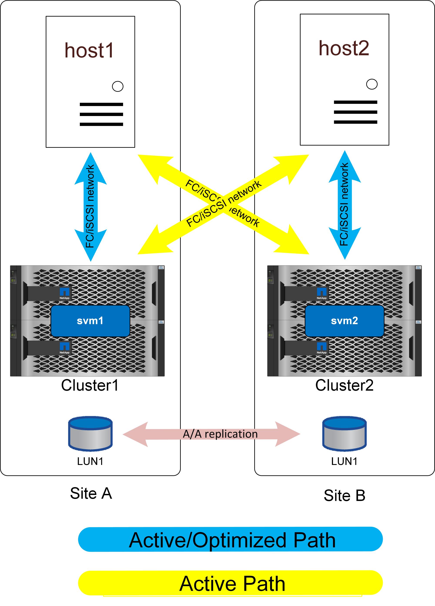

= 균일한 액세스
:allow-uri-read: 
:imagesdir: ../media/

[role="lead"]
균일한 액세스 네트워킹은 호스트가 두 사이트(또는 동일한 사이트 내의 장애 도메인)의 경로를 액세스할 수 있음을 의미합니다.

SM-AS의 중요한 기능은 호스트의 위치를 알 수 있도록 스토리지 시스템을 구성하는 기능입니다. 특정 호스트에 LUN을 매핑할 때 해당 LUN이 지정된 스토리지 시스템에 근접한지 여부를 지정할 수 있습니다.

== 근접 설정

근접성은 특정 호스트 WWN 또는 iSCSI 이니시에이터 ID가 로컬 호스트에 속함을 나타내는 클러스터별 구성을 의미합니다. LUN 액세스를 구성하는 두 번째 선택적 단계입니다.

첫 번째 단계는 일반적인 igroup 구성입니다. 각 LUN은 해당 LUN에 액세스해야 하는 호스트의 WWN/iSCSI ID가 포함된 igroup에 매핑되어야 합니다. LUN에 대한 액세스 권한이 있는 호스트를 제어합니다.

두 번째 단계는 호스트 근접성을 구성하는 것입니다. 액세스를 제어하지 않고 _priority_를 제어합니다.

예를 들어 사이트 A의 호스트가 SnapMirror 활성 동기화로 보호되는 LUN을 액세스하도록 구성할 수 있고 SAN이 사이트 간에 확장되므로 사이트 A의 스토리지 또는 사이트 B의 스토리지를 사용하여 해당 LUN에 대한 경로를 사용할 수 있습니다

근접 설정이 없으면 두 스토리지 시스템 모두 활성/최적화된 경로를 홍보하기 때문에 해당 호스트는 두 스토리지 시스템을 동일하게 사용합니다. 사이트 간 SAN 대기 시간 및/또는 대역폭이 제한된 경우 이를 원하지 않을 수 있으며, 정상적인 작업 중에 각 호스트가 로컬 스토리지 시스템에 대한 경로를 우선적으로 사용하도록 할 수 있습니다. 호스트 WWN/iSCSI ID를 로컬 클러스터에 근위부 호스트로 추가하여 구성합니다. 이 작업은 CLI 또는 SystemManager에서 수행할 수 있습니다.

== AFF

AFF 시스템의 경우 호스트 근접성이 구성된 경우 경로가 아래와 같이 표시됩니다.

정상 작동 시 모든 입출력은 로컬 입출력입니다. 읽기와 쓰기는 로컬 스토리지 시스템에서 서비스됩니다. 물론 쓰기 입출력도 인식되기 전에 로컬 컨트롤러에 의해 원격 시스템으로 복제되어야 하지만 모든 읽기 입출력은 로컬로 처리되며 사이트 간 SAN 링크를 통과하여 추가적인 지연 시간이 발생하지 않습니다.

최적화되지 않은 경로는 액티브/최적화 경로가 모두 손실되는 경우에만 사용됩니다. 예를 들어, 사이트 A의 전체 스토리지에 전원이 공급되지 않으면 사이트 A의 호스트가 사이트 B의 어레이에 대한 경로에 액세스할 수 있으므로 지연 시간이 더 길더라도 작동 상태를 유지할 수 있습니다.

로컬 클러스터를 통한 중복 경로가 있습니다. 이러한 경로는 단순성을 위해 이러한 다이어그램에 표시되지 않습니다. ONTAP 스토리지 시스템은 HA 자체이므로 컨트롤러 장애가 사이트 장애로 이어질 수 없습니다. 영향을 받는 사이트에서 사용되는 로컬 경로가 변경될 뿐입니다.

== ASA

NetApp ASA 시스템은 클러스터의 모든 경로에 대해 액티브-액티브 다중 경로를 제공합니다. 이는 SM-AS 구성에도 적용됩니다.

image:../media/smas-uniform-asa.png["SnapMirror 액티브 싱크 ASA 유니폼 네트워킹"]

비균일 액세스를 사용하는 ASA 구성은 AFF와 거의 동일합니다. 균일한 액세스의 경우 입출력이 WAN을 통과하게 됩니다. 이것은 바람직하지 않을 수도 있습니다.

두 사이트가 파이버 연결을 통해 100m 떨어져 있는 경우 WAN을 통해 추가 지연 시간을 감지할 수 없지만 사이트가 멀리 떨어져 있으면 두 사이트에서 읽기 성능이 저하됩니다. 이와 반대로 AFF에서는 사용 가능한 로컬 경로가 없는 경우에만 WAN 교차 경로를 사용하고 모든 입출력이 로컬 입출력이기 때문에 일상적인 성능이 더 나을 것입니다. 비균일 액세스 네트워크를 사용하는 ASA는 사이트 간 지연 시간 액세스 패널티 없이 ASA의 비용 및 기능 이점을 얻을 수 있는 옵션이 될 것입니다.

지연 시간이 짧은 구성의 SM-AS를 사용하는 ASA는 두 가지 흥미로운 이점을 제공합니다. 첫째로, IO는 2배 더 많은 경로를 사용하여 2배 더 많은 컨트롤러가 처리할 수 있기 때문에 모든 단일 호스트의 성능을 두 배 * 제공합니다. 둘째, 단일 사이트 환경에서 호스트 액세스를 중단하지 않고 전체 스토리지 시스템을 손실할 수 있기 때문에 최고의 가용성을 제공합니다.
