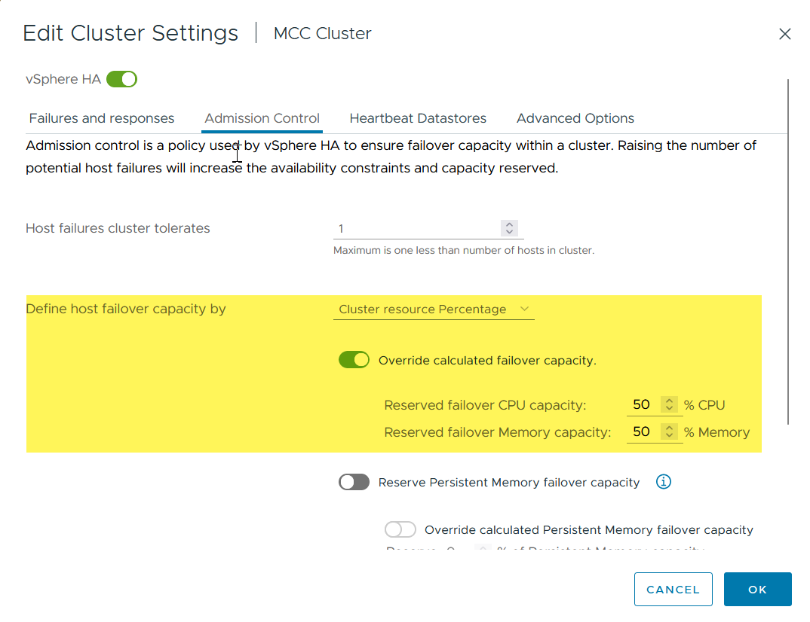
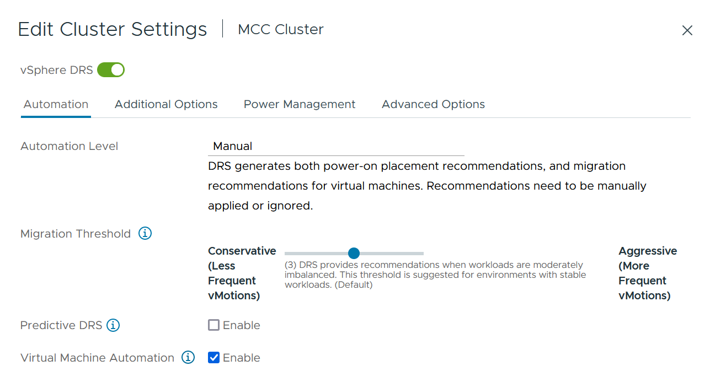
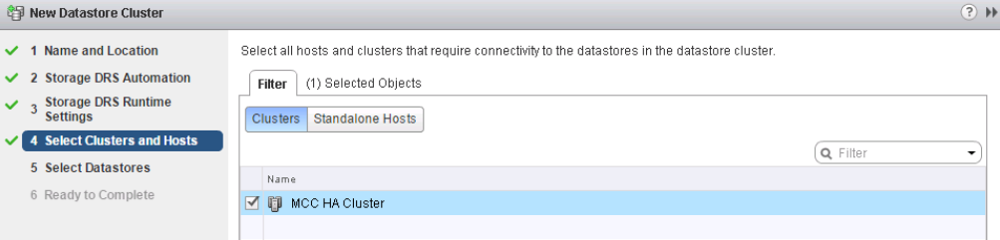

= vMSC 설계 및 구현 지침
:hardbreaks:
:allow-uri-read: 
:nofooter: 
:icons: font
:linkattrs: 
:imagesdir: ../media/

[role="lead"]
이 문서에서는 ONTAP 스토리지 시스템을 지원하는 vMSC에 대한 설계 및 구현 지침을 개략적으로 설명합니다.

== NetApp 스토리지 구성

NetApp MetroCluster에 대한 설정 지침(MCC 구성이라고 함)은 에서 확인할 수 있습니다 https://docs.netapp.com/us-en/ontap-metrocluster/["MetroCluster 문서"]. SnapMirror 활성 동기화에 대한 지침은 에서도 확인할 수 있습니다 https://docs.netapp.com/us-en/ontap/smbc/index.html["SnapMirror 비즈니스 연속성 개요"].

MetroCluster를 구성한 후에는 기존 ONTAP 환경을 관리하는 것과 같습니다. CLI(Command Line Interface), System Manager, Ansible과 같은 다양한 툴을 사용하여 SVM(스토리지 가상 머신)을 설정할 수 있습니다. SVM을 구성한 후 정상 작업에 사용할 클러스터에 논리 인터페이스(LIF), 볼륨 및 논리 유닛 번호(LUN)를 생성합니다. 이러한 오브젝트는 클러스터 피어링 네트워크를 사용하여 다른 클러스터로 자동으로 복제됩니다.

MetroCluster를 사용하지 않는 경우 SnapMirror 액티브 동기화를 사용하여 서로 다른 장애 도메인에 있는 여러 ONTAP 클러스터에서 데이터 저장소에 대한 세분화된 보호와 액티브-액티브 액세스를 제공할 수 있습니다. SnapMirror 액티브 동기화에서는 정합성 보장 그룹을 사용하여 하나 이상의 데이터 저장소 간에 쓰기 순서 일관성을 보장하고 애플리케이션 및 데이터 저장소 요구 사항에 따라 여러 정합성 보장 그룹을 생성할 수 있습니다. 일관성 그룹은 여러 데이터 저장소 간에 데이터를 동기화해야 하는 애플리케이션에 특히 유용합니다. 또한 SnapMirror 활성 동기화는 RDM(Raw Device Mappings) 및 게스트 내 iSCSI 초기자가 있는 게스트 연결 스토리지를 지원합니다. 일관성 그룹에 대한 자세한 내용은 에서 확인할 수 있습니다 https://docs.netapp.com/us-en/ontap/consistency-groups/index.html["일관성 그룹 개요"].

SnapMirror 액티브 동기화를 사용하여 vMSC 구성을 관리하는 것은 MetroCluster와 비교하여 몇 가지 차이가 있습니다. 첫째, SAN 전용 구성이며 SnapMirror 활성 동기화로 NFS 데이터 저장소를 보호할 수 없습니다. 둘째, 두 장애가 발생한 도메인 모두에서 복제된 데이터 저장소를 액세스할 수 있도록 LUN의 두 복제본을 ESXi 호스트에 매핑해야 합니다.

== VMware vSphere HA

=== vSphere HA 클러스터를 생성합니다

vSphere HA 클러스터 생성은 에서 자세히 설명하는 다단계 프로세스입니다 https://docs.vmware.com/en/VMware-vSphere/8.0/vsphere-vcenter-esxi-management/GUID-F7818000-26E3-4E2A-93D2-FCDCE7114508.html["docs.vmware.com 에서 vSphere Client에서 클러스터를 생성하고 구성하는 방법"]. 즉, 먼저 빈 클러스터를 생성한 다음 vCenter를 사용하여 호스트를 추가하고 클러스터의 vSphere HA 및 기타 설정을 지정해야 합니다.

* 참고: * 이 문서의 어떤 내용도 대체되지 않습니다 https://core.vmware.com/resource/vmware-vsphere-metro-storage-cluster-recommended-practices["VMware vSphere Metro Storage Cluster 권장 사례"]

HA 클러스터를 구성하려면 다음 단계를 완료하십시오.

. vCenter UI에 연결합니다.
. 호스트 및 클러스터 에서 HA 클러스터를 생성할 데이터 센터를 찾습니다.
. 데이터 센터 개체를 마우스 오른쪽 버튼으로 클릭하고 New Cluster를 선택합니다. 기본 사항에서 vSphere DRS 및 vSphere HA를 사용하도록 설정했는지 확인합니다. 마법사를 완료합니다.

image::../media/vmsc_3_1.png[새 클러스터,624,302]

. 클러스터를 선택하고 구성 탭으로 이동합니다. vSphere HA를 선택하고 Edit를 클릭합니다.
. 호스트 모니터링 에서 호스트 모니터링 활성화 옵션을 선택합니다.

image::../media/vmsc_3_2.png[호스트 모니터링 옵션을 활성화합니다,624,475]

. 오류 및 응답 탭에 있는 VM 모니터링에서 VM 모니터링만 옵션 또는 VM 및 애플리케이션 모니터링 옵션을 선택합니다.

image::../media/vmsc_3_3.png[VM 모니터링,624,480]

. Admission Control에서 HA 승인 제어 옵션을 cluster resource reserve로 설정하고 50% CPU/MEM을 사용합니다.

. "Ok"를 클릭합니다.
. DRS를 선택하고 편집을 클릭합니다.
. 응용 프로그램에서 요구하지 않는 한 자동화 수준을 수동으로 설정합니다.

. VM 구성 요소 보호를 활성화합니다. 을 참조하십시오 https://docs.vmware.com/en/VMware-vSphere/8.0/vsphere-availability/GUID-F01F7EB8-FF9D-45E2-A093-5F56A788D027.html["docs.vmware.com"].
. MCC가 있는 vMSC에는 다음과 같은 vSphere HA 설정이 추가로 권장됩니다.

[cols="50%,50%"]
|===
| 실패 | 응답 

| 호스트 오류입니다 | VM을 다시 시작합니다 

| 호스트 격리 | 사용 안 함 

| 영구적 디바이스 손실(PDL)이 있는 데이터 저장소 | VM의 전원을 끄고 다시 시작합니다 

| 모든 경로가 다운된 데이터 저장소(APD) | VM의 전원을 끄고 다시 시작합니다 

| 손님이 마음을 아프지 않습니다 | VM을 재설정합니다 

| VM 다시 시작 정책 | VM의 중요도에 따라 결정됩니다 

| 호스트 격리에 대한 응답입니다 | VM을 종료하고 다시 시작합니다 

| PDL이 있는 데이터 저장소에 대한 응답입니다 | VM의 전원을 끄고 다시 시작합니다 

| APD가 있는 데이터 저장소에 대한 응답입니다 | VM 전원 끄기 및 재시작(기본) 

| APD에 대한 VM 장애 조치 지연 | 3분 

| APD 시간 제한이 설정된 APD 복구에 대한 응답입니다 | 사용 안 함 

| VM 모니터링 민감도 | 사전 설정 높음 
|===

=== Heartbeating에 대한 데이터 저장소를 구성합니다

vSphere HA는 관리 네트워크에 장애가 발생한 경우 데이터 저장소를 사용하여 호스트와 가상 머신을 모니터링합니다. vCenter가 하트비트 데이터 저장소를 선택하는 방법을 구성할 수 있습니다. 하트비팅을 위해 데이터 저장소를 구성하려면 다음 단계를 수행하십시오.

. Datastore Heartbeating 섹션에서 Specified List 에서 Use datastores 를 선택하고 필요한 경우 자동으로 보완합니다.
. vCenter가 두 사이트에서 사용할 데이터 저장소를 선택하고 OK를 누릅니다.

image::../media/vmsc_3_6.png[자동으로 생성된 컴퓨터 설명 스크린샷,624,540]

=== 고급 옵션 구성

* 호스트 장애 감지 *

격리 이벤트는 HA 클러스터에 있는 호스트가 네트워크 또는 클러스터의 다른 호스트에 대한 연결이 끊어질 때 발생합니다. 기본적으로 vSphere HA는 관리 네트워크의 기본 게이트웨이를 기본 격리 주소로 사용합니다. 하지만 ping을 수행할 호스트에 대한 추가 격리 주소를 지정하여 격리 응답을 트리거할지 여부를 결정할 수 있습니다. 사이트당 하나씩 ping을 수행할 수 있는 두 개의 격리 IP를 추가합니다. 게이트웨이 IP를 사용하지 마십시오. 사용되는 vSphere HA 고급 설정은 DAS.isolationaddress입니다. 이러한 목적으로 ONTAP 또는 중재자 IP 주소를 사용할 수 있습니다.

을 참조하십시오 https://core.vmware.com/resource/vmware-vsphere-metro-storage-cluster-recommended-practices#sec2-sub5["core.vmware.com"] 자세한 내용은 __.__

image::../media/vmsc_3_7.png[자동으로 생성된 컴퓨터 설명 스크린샷,624,545]

das.heartbeatDsPerHost 라는 고급 설정을 추가하면 하트비트 데이터 저장소의 수가 증가할 수 있습니다. 사이트당 2개씩 4개의 하트비트 데이터 저장소(HB DSS)를 사용합니다. "목록에서 선택 하지만 칭찬" 옵션을 사용합니다. 한 사이트에 장애가 발생해도 두 개의 HB DSS가 필요하기 때문입니다. 하지만 MCC 또는 SnapMirror 액티브 동기화로 해당 데이터를 보호할 필요는 없습니다.

을 참조하십시오 https://core.vmware.com/resource/vmware-vsphere-metro-storage-cluster-recommended-practices#sec2-sub5["core.vmware.com"] 자세한 내용은 __.__

NetApp MetroCluster용 VMware DRS Affinity

이 섹션에서는 MetroCluster 환경의 각 사이트\클러스터에 대해 VM 및 호스트용 DRS 그룹을 생성합니다. 그런 다음 VM 호스트 규칙을 구성하여 VM 호스트 선호도를 로컬 스토리지 리소스에 맞춥니다. 예를 들어 사이트 A VM은 VM 그룹 SiteA_VMs에 속하고 사이트 A 호스트는 호스트 그룹 SiteA_HOSTS에 속합니다. 다음으로 VM\Host Rules에서는 SiteA_VMs가 SiteA_hosts의 호스트에서 실행되어야 한다고 설명합니다.

=== _모범 사례_

* NetApp은 그룹*의 호스트에서 실행해야 함*이 아니라 그룹*의 호스트에서 실행되어야 함*을 사용할 것을 적극 권장합니다. 사이트 A 호스트에 장애가 발생할 경우 사이트 A의 VM을 vSphere HA를 통해 사이트 B의 호스트에서 다시 시작해야 하지만, 후자의 사양에서는 하드 규칙이기 때문에 HA가 사이트 B에서 VM을 다시 시작할 수 없습니다. 이전 사양은 소프트 규칙이며 HA가 발생할 경우 위반되므로 성능보다 가용성이 향상됩니다.

* 참고: * 가상 머신이 VM-호스트 선호도 규칙을 위반할 때 트리거되는 이벤트 기반 알람을 생성할 수 있습니다. vSphere Client에서 가상 머신에 대한 새 경고를 추가하고 이벤트 트리거로 "VM is behaving VM-Host Affinity Rule"을 선택합니다. 알람 생성 및 편집에 대한 자세한 내용은 을 참조하십시오 http://pubs.vmware.com/vsphere-51/topic/com.vmware.ICbase/PDF/vsphere-esxi-vcenter-server-51-monitoring-performance-guide.pdf["vSphere 모니터링 및 성능"] 문서화:

=== DRS 호스트 그룹을 생성합니다

사이트 A 및 사이트 B에만 해당하는 DRS 호스트 그룹을 생성하려면 다음 단계를 수행하십시오.

. vSphere 웹 클라이언트에서 인벤토리에서 클러스터를 마우스 오른쪽 버튼으로 클릭하고 설정 을 선택합니다.
. VM\호스트 그룹 을 클릭합니다.
. 추가 를 클릭합니다.
. 그룹의 이름을 입력합니다(예: SiteA_hosts).
. 유형 메뉴에서 호스트 그룹 을 선택합니다.
. Add를 클릭하고 사이트 A에서 원하는 호스트를 선택한 다음 OK를 클릭합니다.
. 사이트 B에 대해 다른 호스트 그룹을 추가하려면 다음 단계를 반복합니다
. 확인 을 클릭합니다.

=== DRS VM 그룹을 생성합니다

사이트 A 및 사이트 B에만 해당하는 DRS VM 그룹을 생성하려면 다음 단계를 수행하십시오.

. vSphere 웹 클라이언트에서 인벤토리에서 클러스터를 마우스 오른쪽 버튼으로 클릭하고 설정 을 선택합니다.

. VM\호스트 그룹 을 클릭합니다.
. 추가 를 클릭합니다.
. 그룹의 이름을 입력합니다(예: SiteA_VMs).
. 유형 메뉴에서 VM 그룹 을 선택합니다.
. 추가 를 클릭하고 사이트 A에서 원하는 VM을 선택한 다음 확인 을 클릭합니다.
. 사이트 B에 대해 다른 호스트 그룹을 추가하려면 다음 단계를 반복합니다
. 확인 을 클릭합니다.

=== VM 호스트 규칙을 생성합니다

사이트 A 및 사이트 B에 고유한 DRS 선호도 규칙을 만들려면 다음 단계를 수행하십시오.

. vSphere 웹 클라이언트에서 인벤토리에서 클러스터를 마우스 오른쪽 버튼으로 클릭하고 설정 을 선택합니다.

. VM\호스트 규칙을 클릭합니다.
. 추가 를 클릭합니다.
. 규칙의 이름을 입력합니다(예: SiteA_affinity).
. 규칙 사용 옵션이 선택되어 있는지 확인합니다.
. 유형 메뉴에서 가상 머신을 호스트에 선택합니다.
. VM 그룹(예: SiteA_VMS)을 선택합니다.
. 호스트 그룹(예: SiteA_hosts)을 선택합니다.
. 이 단계를 반복하여 사이트 B에 대해 다른 VM\호스트 규칙을 추가합니다
. 확인 을 클릭합니다.

image::../media/vmsc_3_8.png[자동으로 생성된 컴퓨터 설명 스크린샷,474,364]

== NetApp MetroCluster용 VMware vSphere Storage DRS

=== 데이터 저장소 클러스터를 생성합니다

각 사이트에 대해 데이터 저장소 클러스터를 구성하려면 다음 단계를 완료합니다.

. vSphere Web Client를 사용하여 Storage 아래에 HA 클러스터가 있는 데이터 센터로 이동합니다.
. 데이터 센터 개체를 마우스 오른쪽 버튼으로 클릭하고 스토리지 > 새 데이터 저장소 클러스터 를 선택합니다.
. Turn on Storage DRS 옵션을 선택하고 Next를 클릭합니다.
. 모든 옵션을 자동화 안 함(수동 모드)으로 설정하고 다음을 클릭합니다.

==== _모범 사례_

* NetApp는 관리자가 마이그레이션이 필요한 시기를 결정하고 제어할 수 있도록 Storage DRS를 수동 모드로 구성하는 것이 좋습니다.

image::../media/vmsc_3_9.png[Storage DRS를 참조하십시오,528,94]

. Enable I/O Metric for SDRS Recommendations 확인란이 선택되어 있는지 확인합니다. 메트릭 설정을 기본값으로 유지할 수 있습니다.

image::../media/vmsc_3_10.png[SDRS 권장 사항,624,241]

. HA 클러스터를 선택하고 Next를 클릭합니다.

. 사이트 A에 속하는 데이터 저장소를 선택하고 Next를 클릭합니다.

image::../media/vmsc_3_12.png[데이터 저장소,624,134]

. 옵션을 검토하고 마침 을 클릭합니다.
. 이 단계를 반복하여 사이트 B 데이터 저장소 클러스터를 생성하고 사이트 B의 데이터 저장소만 선택되어 있는지 확인합니다.

=== vCenter Server 가용성

vCenter Server Appliance(VCSA)는 vCenter HA로 보호되어야 합니다. vCenter HA를 사용하면 액티브-패시브 HA 쌍에 VCSA 두 개를 구축할 수 있습니다. 각 장애 도메인에 1개 에서 vCenter HA에 대한 자세한 내용을 확인할 수 있습니다 https://docs.vmware.com/en/VMware-vSphere/8.0/vsphere-availability/GUID-4A626993-A829-495C-9659-F64BA8B560BD.html["docs.vmware.com"].
