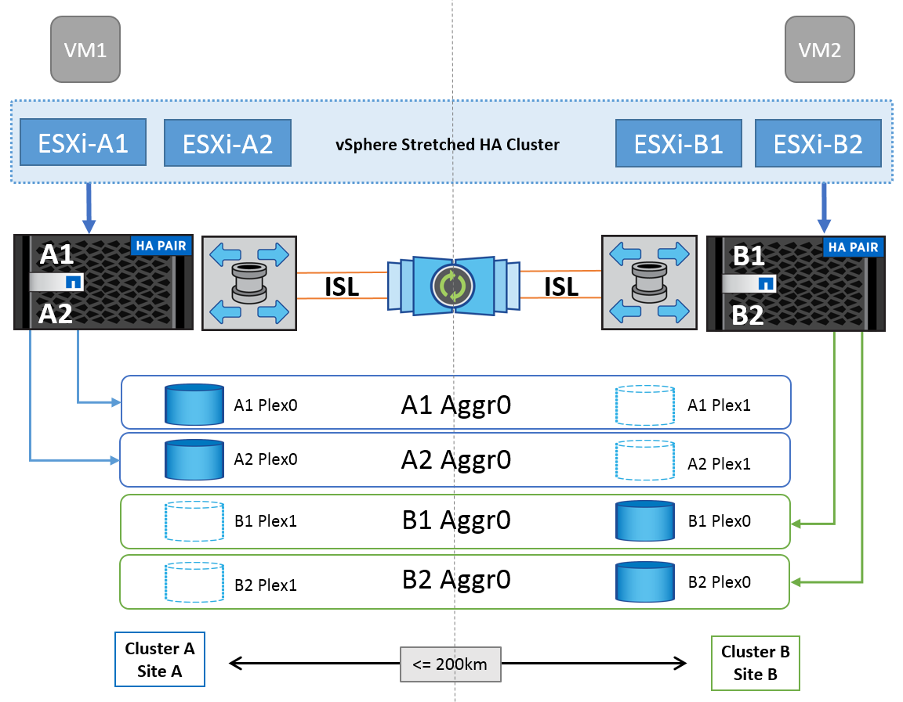

= ONTAP이 포함된 vSphere Metro 스토리지 클러스터
:hardbreaks:
:allow-uri-read: 
:nofooter: 
:icons: font
:linkattrs: 
:imagesdir: ../media/

[role="lead"]
업계 최고 수준의 VMware vSphere 하이퍼바이저를 vMSC(vSphere Metro Storage Cluster)라고 하는 확장 클러스터로 구축할 수 있습니다.

vMSC 솔루션은 NetApp ® MetroCluster 및 SnapMirror Active Sync(이전 명칭: SnapMirror Business Continuity, SMBC)에서 모두 지원되며 하나 이상의 장애 도메인이 완전히 중단될 경우 고급 비즈니스 연속성을 제공합니다. 다양한 실패 모드에 대한 복원력은 선택한 구성 옵션에 따라 다릅니다.

== vSphere 환경을 위한 무중단 가용성 솔루션

ONTAP 아키텍처는 데이터 저장소에 SAN(FCP, iSCSI 및 NVMe-oF) 및 NAS(NFS v3 및 v4.1) 서비스를 제공하는 유연하고 확장 가능한 스토리지 플랫폼입니다. NetApp AFF, ASA 및 FAS 스토리지 시스템은 ONTAP 운영 체제를 사용하여 S3 및 SMB와 같은 게스트 스토리지 액세스를 위한 추가 프로토콜을 제공합니다.

NetApp MetroCluster는 NetApp의 HA(컨트롤러 페일오버 또는 CFO) 기능을 사용하여 컨트롤러 장애로부터 보호합니다. 또한, 로컬 SyncMirror 기술, 재해 시 클러스터 페일오버(주문형 컨트롤러 페일오버 또는 CFOD), 하드웨어 이중화 및 지리적 분리를 통해 높은 수준의 가용성을 달성합니다. SyncMirror은 데이터를 두 플렉스에 기록하여 MetroCluster 구성의 두 부분에 걸쳐 동기식으로 데이터를 미러링합니다. 로컬 플렉스(로컬 쉘프에 있음)가 데이터를 능동적으로 제공하고 원격 플렉스(원격 쉘프에 있음)는 일반적으로 데이터를 제공하지 않음. 컨트롤러, 스토리지, 케이블, 스위치(패브릭 MetroCluster와 함께 사용), 어댑터와 같은 모든 MetroCluster 구성요소에 대해 하드웨어 이중화가 적용됩니다.

NetApp SnapMirror 액티브 동기화는 FCP 및 iSCSI SAN 프로토콜을 통해 데이터 저장소의 세부적 보호 기능을 제공하므로 우선순위가 높은 워크로드만 선택적으로 보호할 수 있습니다. 액티브-대기 솔루션인 NetApp MetroCluster와 달리, 미러링된 사이트 모두에서 대칭 액티브-액티브 액세스를 제공합니다.

두 사이트에 걸쳐 VMware HA/DRS 클러스터를 생성하기 위해 ESXi 호스트는 VCSA(vCenter Server Appliance)에 의해 사용되고 관리됩니다. vSphere 관리, vMotion ® 및 가상 머신 네트워크는 두 사이트 간에 중복 네트워크를 통해 연결됩니다. HA/DRS 클러스터를 관리하는 vCenter Server는 두 사이트의 ESXi 호스트에 연결할 수 있으며 vCenter HA를 사용하여 구성해야 합니다.

을 참조하십시오 https://docs.vmware.com/en/VMware-vSphere/8.0/vsphere-vcenter-esxi-management/GUID-F7818000-26E3-4E2A-93D2-FCDCE7114508.html["vSphere Client에서 클러스터를 생성하고 구성하는 방법"] vCenter HA를 구성합니다.

또한 을 참조하십시오 https://core.vmware.com/resource/vmware-vsphere-metro-storage-cluster-recommended-practices["VMware vSphere Metro Storage Cluster 권장 사례"].

== vSphere Metro Storage Cluster란 무엇입니까?

vMSC(vSphere Metro Storage Cluster)는 VM(가상 머신) 및 컨테이너를 장애로부터 보호하는 인증 구성입니다. 이는 확장 스토리지 개념을 랙, 건물, 캠퍼스 또는 도시와 같은 여러 장애 도메인에 분산되는 ESXi 호스트 클러스터와 함께 사용하여 달성할 수 있습니다. NetApp MetroCluster 및 SnapMirror Active sync 스토리지 기술은 호스트 클러스터에 각각 RPO=0 또는 RPO=0 정도의 보호를 제공하는 데 사용됩니다. vMSC 구성은 완전한 물리적 또는 논리적 "사이트"에 장애가 발생하더라도 데이터를 항상 사용할 수 있도록 설계되었습니다. vMSC 구성에 포함된 스토리지 디바이스는 vMSC 인증 프로세스를 성공적으로 완료한 후 인증을 받아야 합니다. 지원되는 모든 저장 장치는 에서 찾을 수 있습니다 https://www.vmware.com/resources/compatibility/search.php["VMware 스토리지 호환성 가이드 를 참조하십시오"].

vSphere Metro Storage Cluster의 설계 지침에 대한 자세한 내용은 다음 설명서를 참조하십시오.

* https://kb.vmware.com/s/article/2031038["VMware vSphere는 NetApp MetroCluster를 지원합니다"]
* https://kb.vmware.com/s/article/83370["NetApp SnapMirror 비즈니스 연속성이 포함된 VMware vSphere 지원"] (현재 SnapMirror Active Sync라고 함)

지연 시간 고려 사항에 따라 NetApp MetroCluster는 vSphere와 함께 사용할 수 있도록 두 가지 구성으로 구축할 수 있습니다.

* MetroCluster를 확장합니다
* Fabric MetroCluster의 약어입니다

다음은 확장 MetroCluster의 상위 수준 토폴로지 다이어그램을 보여 줍니다.

을 참조하십시오 https://www.netapp.com/support-and-training/documentation/metrocluster/["MetroCluster 설명서"] MetroCluster에 대한 구체적인 설계 및 구축 정보를 확인하십시오.

SnapMirror Active Sync는 두 가지 방법으로 배포할 수도 있습니다.

* 비대칭
* 대칭(ONTAP 9.14.1의 비공개 미리보기)

image::../media/vmsc_1_2.png[MCC가 포함된 vMSC 다이어그램,624,485]

대칭 또는 비대칭 설계 및 배포의 이점에 대한 자세한 내용은 를 참조하십시오 https://docs.netapp.com/us-en/ontap/smbc/index.html["SnapMirror 활성 동기화 설명서"].
