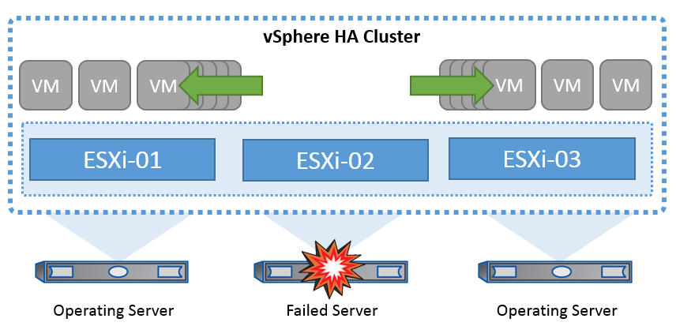

= VMware vSphere 솔루션 개요
:hardbreaks:
:allow-uri-read: 
:nofooter: 
:icons: font
:linkattrs: 
:imagesdir: ../media/

[role="lead"]
VCSA(vCenter Server Appliance)는 관리자가 ESXi 클러스터를 효과적으로 운영할 수 있도록 지원하는 강력한 중앙 집중식 관리 시스템이자 vSphere용 단일 창입니다. VM 프로비저닝, vMotion 작업, HA(고가용성), DRS(Distributed Resource Scheduler), Tanzu Kubernetes Grid 등의 주요 기능을 지원합니다. VMware 클라우드 환경에서 필수적인 구성 요소이며 서비스 가용성을 고려하여 설계해야 합니다.

== vSphere 고가용성

VMware의 클러스터 기술은 ESXi 서버를 가상 시스템용 공유 리소스 풀로 그룹화하고 vSphere HA(High Availability)를 제공합니다. vSphere HA는 가상 머신에서 실행되는 애플리케이션에 사용하기 쉽고 고가용성을 제공합니다. 클러스터에서 HA 기능이 활성화된 경우 각 ESXi 서버는 다른 호스트와 통신을 유지하여 ESXi 호스트가 응답하지 않거나 격리될 경우 HA 클러스터는 클러스터의 남은 호스트 간에 해당 ESXi 호스트에서 실행 중이었던 가상 머신의 복구를 협상할 수 있습니다. 게스트 운영 체제에 장애가 발생할 경우 vSphere HA는 영향을 받는 가상 머신을 동일한 물리적 서버에서 다시 시작합니다. vSphere HA를 사용하면 계획된 다운타임을 줄이고, 예기치 않은 다운타임을 방지하며, 운영 중단으로부터 신속하게 복구할 수 있습니다.

vSphere HA 클러스터 장애가 발생한 서버에서 VM을 복구합니다.

VMware vSphere는 NetApp MetroCluster 또는 SnapMirror 활성 동기화에 대한 지식이 없으며 호스트 및 VM 그룹 선호도 구성에 따라 vSphere 클러스터의 모든 ESXi 호스트를 HA 클러스터 작업에 적합한 호스트로 간주한다는 점을 이해하는 것이 중요합니다.

== 호스트 장애 감지

HA 클러스터가 생성되면 클러스터의 모든 호스트가 선택에 참여하며 호스트 중 하나가 마스터가 됩니다. 각 슬레이브는 네트워크 하트비트를 마스터로 수행하고, 마스터는 모든 슬레이브 호스트에서 네트워크 하트비트를 수행합니다. vSphere HA 클러스터의 마스터 호스트는 슬레이브 호스트의 장애를 감지합니다.

감지된 장애 유형에 따라 호스트에서 실행 중인 가상 머신을 페일오버해야 할 수 있습니다.

vSphere HA 클러스터에서 세 가지 유형의 호스트 장애가 감지됩니다.

* 실패 - 호스트의 작동이 중지됩니다.
* 격리 - 호스트가 네트워크를 격리합니다.
* 파티션 - 호스트와 마스터 호스트의 네트워크 연결이 끊깁니다.

마스터 호스트는 클러스터의 슬레이브 호스트를 모니터링합니다. 이 통신은 네트워크 하트비트를 1초마다 교환하여 이루어집니다. 마스터 호스트가 슬레이브 호스트로부터 이러한 하트비트 수신을 중지하면 호스트가 실패했다고 선언하기 전에 호스트 활성 여부를 확인합니다. 마스터 호스트가 수행하는 활성 점검은 슬레이브 호스트가 데이터 저장소 중 하나와 하트비트를 교환하는지 여부를 확인하는 것입니다. 또한 마스터 호스트는 호스트가 관리 IP 주소로 전송된 ICMP 핑에 응답하여 호스트가 단순히 마스터 노드에서 격리되는지 아니면 네트워크에서 완전히 격리되는지 여부를 검사합니다. 기본 게이트웨이에 대해 ping을 수행하여 이 작업을 수행합니다. 하나 이상의 격리 주소를 수동으로 지정하여 격리 유효성 검사의 안정성을 향상시킬 수 있습니다.

[TIP]
====
NetApp에서는 최소 2개의 추가 격리 주소를 지정하고 각 주소는 사이트-로컬 주소를 지정하는 것이 좋습니다. 이렇게 하면 격리 검증의 신뢰성이 향상됩니다.

====

== 호스트 격리 응답

격리 응답은 vSphere HA의 설정으로, vSphere HA 클러스터의 호스트에서 관리 네트워크 연결이 끊어지지만 계속 실행되는 경우 가상 시스템에서 트리거되는 작업을 결정합니다. 이 설정에는 "사용 안 함", "VM 종료 및 다시 시작", "VM 전원 끄기 및 다시 시작"이라는 세 가지 옵션이 있습니다.

"시스템 종료"는 "전원 끄기"보다 낫습니다. 이는 디스크에 대한 가장 최근의 변경 사항을 플러시하거나 트랜잭션을 커밋하지 않습니다. 가상 시스템이 300초 내에 종료되지 않으면 전원이 꺼집니다. 대기 시간을 변경하려면 고급 옵션인 DAS.isolationshutdowntimeout을 사용합니다.

HA는 격리 응답을 시작하기 전에 먼저 vSphere HA 마스터 에이전트가 VM 구성 파일이 포함된 데이터 저장소를 소유하는지 확인합니다. 그렇지 않으면 VM을 다시 시작할 마스터가 없기 때문에 호스트가 격리 응답을 트리거하지 않습니다. 호스트는 정기적으로 데이터 저장소 상태를 확인하여 마스터 역할을 가진 vSphere HA 에이전트에서 데이터 저장소를 요청하는지 확인합니다.

[TIP]
====
NetApp에서는 "호스트 격리 응답"을 사용 안 함으로 설정하는 것이 좋습니다.

====
호스트가 vSphere HA 마스터 호스트에서 격리 또는 파티션되고 마스터가 하트비트 데이터 저장소 또는 Ping을 통해 통신할 수 없는 경우 브레인 분할 상태가 발생할 수 있습니다. 마스터가 격리된 호스트를 작동하지 않음을 선언하고 클러스터의 다른 호스트에서 VM을 다시 시작합니다. 가상 시스템의 두 인스턴스가 실행 중이기 때문에 브레인 분할 조건이 존재합니다. 그 중 하나만 가상 디스크를 읽거나 쓸 수 있습니다. 이제 VM 구성 요소 보호(VMCP)를 구성하여 브레인 분할 조건을 방지할 수 있습니다.

== VM 구성 요소 보호(VMCP)

HA와 관련된 vSphere 6의 향상된 기능 중 하나는 VMCP입니다. VMCP는 블록(FC, iSCSI, FCoE) 및 파일 스토리지(NFS)에 대한 APD(All Path Down) 및 PDL(Permanent Device Loss) 조건에서 향상된 보호 기능을 제공합니다.

=== 영구적 장치 손실(PDL)

PDL은 저장소 장치가 영구적으로 실패하거나 관리자가 제거되어 반환되지 않을 때 발생하는 상태입니다. NetApp 스토리지 배열은 ESXi에 SCSI 감지 코드를 발행하여 디바이스가 영구적으로 손실되었음을 알립니다. vSphere HA의 Failure Conditions and VM Response 섹션에서 PDL 조건이 감지된 후 응답을 구성할 수 있습니다.

[TIP]
====
NetApp은 "PDL을 사용한 데이터 저장소 응답"을 " * VM 전원을 끄고 다시 시작 * "으로 설정할 것을 권장합니다. 이 상태가 감지되면 vSphere HA 클러스터 내의 정상 호스트에서 VM이 즉시 재시작됩니다.

====

=== 모든 경로 다운(APD)

APD는 스토리지 디바이스가 호스트에 액세스할 수 없고 스토리지에 대한 경로를 사용할 수 없는 경우에 발생하는 상태입니다. ESXi는 이 문제가 디바이스의 일시적인 문제로 간주하여 다시 사용할 수 있게 될 것으로 예상하고 있습니다.

APD 조건이 감지되면 타이머가 시작됩니다. 140초 후에 APD 조건이 공식적으로 선언되고 장치가 APD 시간 초과로 표시됩니다. 140초가 지나면 HA는 VM 장애 조치 APD에 지정된 시간(분)을 계산하기 시작합니다. 지정된 시간이 경과하면 HA가 영향을 받는 가상 머신을 다시 시작합니다. 원하는 경우 다르게 응답하도록 VMCP를 구성할 수 있습니다(사용 안 함, 이벤트 발생 또는 VM 전원 끄기 및 재시작).

[TIP]
====
* NetApp은 “APD를 사용한 데이터 저장소에 대한 응답”을 “* VM 전원을 끄고 다시 시작(보수적)*”으로 구성할 것을 권장합니다.
* 보존적 은 HA가 VM을 다시 시작할 수 있는 가능성을 나타냅니다. 보존으로 설정하면 다른 호스트가 다시 시작할 수 있다는 것을 알고 있는 경우에만 HA가 APD의 영향을 받는 VM을 다시 시작합니다. 공격적인 경우 HA는 다른 호스트의 상태를 모르는 경우에도 VM을 다시 시작합니다. 따라서 해당 데이터 저장소에 액세스할 수 있는 호스트가 없는 경우 VM이 다시 시작되지 않을 수 있습니다.
* APD 상태가 해결되고 제한 시간이 경과하기 전에 스토리지에 대한 액세스가 복구되는 경우, 사용자가 명시적으로 가상 머신을 구성하지 않으면 HA가 가상 머신을 불필요하게 다시 시작하지 않습니다. 환경이 APD 조건으로부터 복구된 경우에도 응답이 필요한 경우 APD 시간 초과 후 APD 복구에 대한 응답을 VM 재설정 으로 구성해야 합니다.
* NetApp에서는 APD 시간 초과 후 APD 복구에 대한 응답을 사용 안 함으로 구성하는 것이 좋습니다.

====

== NetApp MetroCluster용 VMware DRS 구현

VMware DRS는 클러스터의 호스트 리소스를 집계하는 기능으로, 주로 가상 인프라스트럭처의 클러스터 내에서 로드 밸런싱을 수행하는 데 사용됩니다. VMware DRS는 주로 클러스터에서 로드 밸런싱을 수행하기 위한 CPU 및 메모리 리소스를 계산합니다. vSphere는 늘어난 클러스터링을 인식하지 못하므로 로드 밸런싱 시 두 사이트의 모든 호스트를 고려합니다. 사이트 간 트래픽을 방지하기 위해 NetApp에서는 VM의 논리적 분리를 관리하기 위해 DRS 선호도 규칙을 구성하는 것이 좋습니다. 따라서 전체 사이트 장애가 발생하지 않는 한 HA 및 DRS는 로컬 호스트만 사용합니다.

클러스터에 대한 DRS 선호도 규칙을 생성하는 경우 vSphere가 가상 머신 페일오버 중에 해당 규칙을 적용하는 방법을 지정할 수 있습니다.

vSphere HA 페일오버 동작을 지정할 수 있는 두 가지 규칙 유형이 있습니다.

* VM 반유사성 규칙은 페일오버 작업 중에 지정된 가상 머신이 서로 떨어져 있도록 합니다.
* VM 호스트 선호도 규칙은 페일오버 작업 중에 특정 호스트 또는 정의된 호스트 그룹의 구성원에 지정된 가상 머신을 배치합니다.

VMware DRS의 VM 호스트 선호도 규칙을 사용하면 사이트 A와 사이트 B 간에 논리적 구분을 통해 VM이 지정된 데이터 저장소에 대한 운영 읽기/쓰기 컨트롤러로 구성된 스토리지와 동일한 사이트의 호스트에서 실행되도록 할 수 있습니다. 또한 VM 호스트 선호도 규칙을 통해 가상 머신이 스토리지에 로컬을 유지할 수 있으며, 이 경우 사이트 간에 네트워크 장애가 발생할 경우 가상 머신 연결을 확인할 수 있습니다.

다음은 VM 호스트 그룹 및 선호도 규칙의 예입니다.

image::../media/vmsc_2_2.png[VM 호스트 그룹 및 선호도 규칙,528,369]

=== _모범 사례_

NetApp은 장애 발생 시 vSphere HA로 인해 위반되므로 "Must" 규칙 대신 "Must" 규칙을 적용하는 것이 좋습니다. "필수" 규칙을 사용하면 서비스가 중단될 수 있습니다.

서비스의 가용성은 항상 성과보다 우선해야 합니다. 전체 데이터 센터에 장애가 발생할 경우 "필수" 규칙은 VM 호스트 선호도 그룹에서 호스트를 선택해야 하며, 데이터 센터를 사용할 수 없으면 가상 시스템이 다시 시작되지 않습니다.

== NetApp MetroCluster를 사용한 VMware Storage DRS 구축

VMware Storage DRS 기능을 사용하면 단일 유닛으로 데이터 저장소를 통합할 수 있으며 SIOC(스토리지 입출력 제어) 임계값을 초과할 경우 가상 머신 디스크의 균형을 조정할 수 있습니다.

Storage DRS가 활성화된 DRS 클러스터에서는 스토리지 입출력 제어가 기본적으로 설정됩니다. 스토리지 I/O 제어를 통해 관리자는 I/O 정체 기간 동안 가상 시스템에 할당되는 스토리지 I/O 양을 제어할 수 있으므로 더 중요한 가상 시스템이 I/O 리소스 할당에 덜 중요한 가상 시스템보다 우선 순위를 가질 수 있습니다.

Storage DRS는 Storage vMotion을 사용하여 가상 머신을 데이터 저장소 클러스터 내의 다른 데이터 저장소로 마이그레이션합니다. NetApp MetroCluster 환경에서는 해당 사이트의 데이터 저장소 내에서 가상 머신 마이그레이션을 제어해야 합니다. 예를 들어, 사이트 A의 호스트에서 실행되는 가상 머신 A는 사이트 A의 SVM 데이터 저장소 내에서 마이그레이션하는 것이 이상적입니다 가상 디스크 읽기/쓰기가 사이트 간 링크를 통해 사이트 B에서 이루어지므로 가상 머신이 계속 작동하지만 성능이 저하됩니다.

[TIP]
====
* ONTAP 스토리지를 사용할 경우 Storage DRS를 비활성화하는 것이 좋습니다.

* Storage DRS는 일반적으로 ONTAP 스토리지 시스템에서 사용할 필요가 없거나 권장되지 않습니다.
* ONTAP는 Storage DRS의 영향을 받을 수 있는 데이터 중복 제거, 압축 및 컴팩션과 같은 자체 스토리지 효율성 기능을 제공합니다.
* ONTAP 스냅샷을 사용하는 경우 Storage vMotion은 스냅샷에서 VM의 복제본을 남겨 두므로 스토리지 활용도가 높아지며 VM 및 해당 ONTAP 스냅샷을 추적하는 NetApp SnapCenter와 같은 백업 애플리케이션에 영향을 미칠 수 있습니다.

====